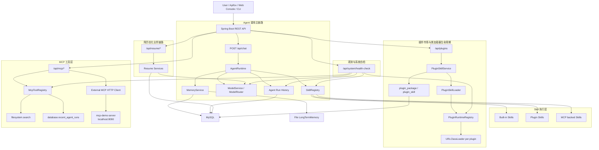

# AI Agent 平台（MCP & Skill 市场）

<div align="center">
  <a href="https://www.bilibili.com/video/BV1RE5F6cEy6" target="_blank" style="display:inline-block; background:#00A1D6; color:white; padding:12px 24px; border-radius:8px; text-decoration:none; font-weight:bold;">
    点击观看demo视频
  </a>
</div>

## 1. 项目简介

本项目是一个基于 **Java 17 + Spring Boot 3.x + Maven** 的 AI Agent 平台后端

项目围绕 Agent 运行时、模型路由、记忆、Skill 市场、MCP 工具接入、插件热加载、运行追踪和复杂业务 Skill 展开。`resume_optimize` 是平台中的一个复杂业务 Skill，用于展示 Agent 如何调用真实业务能力

核心能力包括：

- 多模型配置与运行时动态切换。
- Model Capability Metadata：`provider`、`type`、`enabled`、`capabilities`
- Vision Chat 多模态图片输入 MVP
- 短期记忆 MySQL 持久化与长期记忆文件持久化
- Agent Run History 与 trace 持久化
- Skill Registry 与统一 Skill 启用/禁用
- Plugin Skill Market：Jar 上传、热加载、持久化、启用/禁用、启动恢复
- PluginSkillValidator 插件安装校验
- Skill Manifest：支持插件 Jar 内携带 `META-INF/agent-skill.json`，补充市场分类、标签、示例和权限声明
- PluginRuntimeRegistry 插件运行时与 URLClassLoader 生命周期管理
- MCP Tool Registry、REST MCP 接口、JSON-RPC Adapter
- External MCP HTTP Client：注册、同步和调用外部 MCP Server 工具
- Web 控制台与 PowerShell CLI 控制台
- System Health Check 系统自检
- 简历优化同步/异步任务与追问式调用

## 2. 考核要求完成情况

| 考核要求 | 当前实现 | 完成状态    |
|---|---|---------|
| 多模型配置与动态切换 | `ModelConfig` / `ModelRouter` / `/api/models` / `/api/chat` 传入 `modelId` | 已完成     |
| 多模态模型配置 | `provider` / `type` / `capabilities` / `enabled`，并提供 `/api/models/vision-chat` | MVP 已完成 |
| 短期记忆 | `conversation_message` 表，MySQL 持久化最近对话窗口 | 已完成     |
| 长期记忆 | `FileLongTermMemoryStore` 文件持久化 | 已完成     |
| Skill 市场 | 内置 Skill + 插件 Skill + Jar 上传热加载 | 已完成     |
| Skill 元数据 | `name` / `description` / `parameterSchema` / `version` / `dependencies` | 已完成     |
| Skill 启用/禁用 | 插件包维度 + 单 Skill 维度逻辑启用/禁用 | 已完成     |
| 插件安装校验 | `PluginSkillValidator` 校验 Skill 与 metadata | 已完成     |
| Skill 市场发现 | `GET /api/skills/market` 聚合内置 Skill、插件 Skill、插件状态、runtime 状态、调用统计和 manifest 市场元数据 | MVP 已完成 |
| 插件运行时生命周期 | `PluginRuntimeRegistry` 管理插件运行时，禁用插件时关闭 `URLClassLoader` | MVP 已完成 |
| MCP 兼容 | `tools/list`、`tools/call`、JSON-RPC Adapter、External MCP Client | MVP 已完成 |
| 外部 MCP Server | 独立 `mcp-demo-server`，支持注册、同步、调用 | 已完成     |
| 3 个不同方向 Skill 演示 | `calculator`、`weather`、`file_search`、`resume_optimize`、`text_reverse`、`text_insight`、`mcp_echo_client` 等 | 已完成     |
| 简单管理界面 | 静态 Web Console + PowerShell CLI scripts | 已完成     |
| 系统自检 | `GET /api/system/health-check` 聚合模型、Skill、插件 runtime、MCP、Memory、Console 状态 | 已完成     |

> 说明：本项目当前没有实现完整标准 MCP transport。相关内容放在“当前限制”和“未来规划”中

## 3. 总体架构



## 4. 技术栈

- Java 17
- Spring Boot 3.x
- Spring MVC
- Spring Data JPA
- MySQL
- Flyway
- Maven
- Spring AI / OpenAI-compatible 模型调用
- PDFBox
- Apache POI
- Jsoup
- Java `URLClassLoader` 插件加载
- Java 17 `HttpClient`
- JSON-RPC 风格 MCP Adapter
- PowerShell CLI
- Static HTML Console（无 npm、无 Vue/React）

## 5. 模块说明

### 5.1 AgentRuntime

核心入口：`POST /api/chat`

`AgentRuntime` 是平台的编排核心，负责：

- 接收用户消息并标准化 `conversationId`、`modelId`
- 加载短期记忆与长期记忆
- 保存用户消息到短期记忆
- 优先处理未完成的 pending Skill call
- 识别显式 Skill 调用，例如“请调用 text_reverse 技能”
- 调用 LLM Skill Decision 判断是否需要 Skill
- 通过规则兜底识别计算、天气、文件搜索、简历优化等场景
- 根据 `SkillMetadata.parameterSchema.required` 检查 required 参数
- 参数不足时保存 `PendingSkillCall` 并追问
- 下一轮补参后合并参数并继续调用原 Skill
- 调用 Skill 并记录 `CALL_SKILL` trace
- 对短结果 Skill 可使用模型生成最终自然语言回答
- 对 `resume_optimize` 这类大报告 Skill 保持 direct return，避免二次总结破坏结构
- 保存 assistant 消息到短期记忆
- 保存 `agent_run` 与 `agent_run_trace`

显式调用参数策略：

- `key=value`、`key: value`、`key：value` 显式参数优先级最高
- 为避免误调用，“请调用 text_reverse 技能”不会被当成 `text` 参数
- 如果 Skill 只有一个 required 参数，且该参数在 schema 中类型为 `string`，平台支持规则式自然语言提取

示例：

```text
请调用 mcp_echo_client，把 hello external mcp 转成大写
=> text = hello external mcp

请调用 text_insight 分析这段文本：AI Agent platform supports Skill Market.
=> text = AI Agent platform supports Skill Market.
```

多参数 Skill 仍走追问机制，例如 `resume_optimize` 缺少 `resumeFileId` / `jobPostingId` 时不会自由猜参

### 5.2 Model 模型管理

相关包：`src/main/java/com/sharon/agentplatform/model`

模型配置位于 `application.yml` 的 `agent-platform.models` 下。`ModelConfig` 当前支持：

- `id`
- `displayName`
- `provider`
- `type`
- `baseUrl`
- `apiKey`
- `modelName`
- `temperature`
- `enabled`
- `capabilities`

主要接口：

- `GET /api/models`
- `GET /api/models/{modelId}`
- `POST /api/models/test-chat`
- `POST /api/models/vision-chat`
- `POST /api/chat` 中通过 `modelId` 动态选择模型

当前示例模型：

- `mock-model`
- `siliconflow-qwen`
- `siliconflow-deepseek`
- `siliconflow-qwen-vl`
- `local-ollama`：本地模型配置示例，默认 disabled

模型禁用规则：

- `ModelRouter` 在选择模型时会拒绝 `enabled=false` 的模型
- 调用 disabled model 会返回类似 `Model is disabled: local-ollama` 的业务错误

Vision Chat MVP：

- 接口：`POST /api/models/vision-chat`
- 请求：`multipart/form-data`
- 参数：`modelId`、`message`、`image`
- 校验：图片 `contentType` 必须以 `image/` 开头，大小限制为 5MB
- 模型能力：需要 `capabilities` 包含 `vision` 或 `multimodal`
- 调用格式：OpenAI-compatible vision message，即 `text + image_url(data URL)`
边界：

- 不修改 `/api/chat` 主流程
- 不保存图片文件
- 不保存 base64 内容
- 不支持音频/视频
- 需要配置真实可用的 vision model 才能完成真实图片理解

### 5.3 Memory 记忆管理

相关包：`src/main/java/com/sharon/agentplatform/memory`

本项目区分三类数据：

#### 5.3.1 Short-term memory

- 表：`conversation_message`
- 迁移：`V6__create_conversation_message_table.sql`
- 按 `conversationId` 保存 user / assistant 消息
- 默认读取最近 20 条作为对话窗口
- 服务重启后，同一个 `conversationId` 可以恢复最近对话

主要接口：

- `GET /api/memory/conversations/{conversationId}/messages`
- `GET /api/memory/{conversationId}`

#### 5.3.2 Long-term memory

- 实现：`FileLongTermMemoryStore`
- 用文件保存长期记忆
- 通过 `MemoryService` 与 AgentRuntime 集成

主要接口：

- `POST /api/memory/{conversationId}/long-term`

#### 5.3.3 Run History

- 表：`agent_run`
- 表：`agent_run_trace`
- 迁移：`V2__create_agent_run_tables.sql`
- 用于审计、排查、复盘，不等同于 Agent 下一轮推理用的 Memory

主要接口：

- `GET /api/agent/runs`
- `GET /api/agent/runs/{runId}`

区别：

- Memory：给 Agent 下一轮推理使用
- Run History：给人复盘执行过程使用

### 5.4 Skill 市场

相关包：`src/main/java/com/sharon/agentplatform/skill`

Skill 是 Agent 可调用能力的标准单位。每个 Skill 暴露：

- `metadata()`
- `execute(SkillContext context)`

`SkillMetadata` 包含：

- `name`
- `displayName`
- `description`
- `version`
- `parameterSchema`
- `dependencies`

当前内置 Skill：

- `calculator`
- `weather`
- `file_search`
- `resume_optimize`

主要接口：

- `GET /api/skills`
- `GET /api/skills/{name}`
- `POST /api/skills/{name}/call`
- `POST /api/skills/{name}/enable`
- `POST /api/skills/{name}/disable`
- `GET /api/skills/market`
- `GET /api/skills/stats`

Skill 统计：

- 基于 `agent_run_trace` 中 `step = CALL_SKILL` 的记录统计
- 当前只统计最近 500 条 `CALL_SKILL` trace
- 直接调用 `/api/skills/{name}/call` 如果不经过 AgentRuntime，不一定进入 Run History，因此不一定被统计

统一启用/禁用：

- 表：`skill_setting`
- 迁移：`V7__create_skill_setting_table.sql`
- 内置 Skill 与插件 Skill 都可以逻辑禁用
- 禁用后直接调用和 AgentRuntime 调用都会被阻止

插件 Skill 市场：

- 相关包：`src/main/java/com/sharon/agentplatform/plugin`
- 上传 Jar 到 `data/plugins`
- 通过 `URLClassLoader` 加载 Jar
- 扫描实现 `Skill` 接口的类
- 通过 public 无参构造器实例化
- 注册到 `SkillRegistry`
- 持久化到 `plugin_package` / `plugin_skill`
- 可选读取 Jar 内 `META-INF/agent-skill.json`，保存到 `manifest_json` / `market_metadata_json`
- `/api/skills/market` 用于展示市场发现视图，包括插件来源、状态、runtime、分类、标签、示例、权限声明和调用统计
- 支持插件包 enable / disable
- 支持服务启动时自动恢复 `ENABLED` 插件
- 每个插件包运行时维护独立 `PluginRuntime`
- `PluginRuntimeRegistry` 管理当前 JVM 中已加载的插件 runtime
- 禁用插件时注销对应 Skill、关闭 `URLClassLoader`、移除 runtime 引用

插件主要接口：

- `POST /api/plugins/skills/upload`
- `GET /api/plugins`
- `POST /api/plugins/{pluginId}/enable`
- `POST /api/plugins/{pluginId}/disable`
- `GET /api/plugins/runtime`

当前卸载边界：

- 插件包禁用会关闭 `URLClassLoader` 并移除平台引用
- 不声称 JVM 会立即卸载插件类
- 如果插件代码持有线程、静态缓存或外部引用，ClassLoader 仍可能无法被 GC
- 不删除 Jar
- 不做插件权限沙箱和依赖冲突隔离

### 5.5 PluginSkillValidator

`PluginSkillValidator` 用于插件安装前校验，避免坏 Jar 破坏市场状态

当前校验规则：

- Jar 中必须至少包含一个 Skill
- Skill 实例不能为 null
- `metadata` 不能为 null
- `metadata.name` 不能为空
- `metadata.description` 不能为空
- `metadata.version` 不能为空
- `metadata.parameterSchema` 不能为 null
- 同一个 Jar 内 `skillName` 不能重复
- 上传新 Jar 时，不允许覆盖当前已注册的 `skillName`
- 如果 Jar 内包含 `META-INF/agent-skill.json`，manifest 中声明的 skill 必须能在当前 Jar 中加载出来
- manifest 中不能重复声明同一个 skillName

失败行为：

- `plugin_package.status = FAILED`
- `errorMessage` 保存具体失败原因
- 不注册到 `SkillRegistry`
- 不保存可用的 `plugin_skill`，或确保其不可用

启动恢复：

- 启动恢复会做基础 metadata 校验
- 为避免已注册 Skill 重名影响启动，启动恢复不使用上传时的严格重名拦截

### 5.6 MCP 模块

相关包：`src/main/java/com/sharon/agentplatform/mcp`

当前 MCP 分三层：

#### 5.6.1 内部 McpToolRegistry

核心抽象：

- `McpTool`
- `McpToolMetadata`
- `McpToolRequest`
- `McpToolResponse`
- `McpToolRegistry`

已实现内部工具：

- `filesystem.search`：本地工作区文件/文本搜索演示
- `database.recent_agent_runs`：白名单数据库查询工具，查询最近 Agent Run History，不支持任意 SQL

REST 接口：

- `GET /api/mcp/tools`
- `POST /api/mcp/tools/{toolName}/call`

#### 5.6.2 MCP JSON-RPC Adapter

接口：

- `POST /api/mcp/rpc`

支持 method：

- `tools/list`
- `tools/call`

示例：

```json
{
  "jsonrpc": "2.0",
  "id": 1,
  "method": "tools/list"
}
```

```json
{
  "jsonrpc": "2.0",
  "id": 2,
  "method": "tools/call",
  "params": {
    "name": "filesystem.search",
    "arguments": {
      "keyword": "README"
    }
  }
}
```

#### 5.6.3 External MCP HTTP Client

功能：

- 注册外部 HTTP JSON-RPC MCP Server
- 调用外部 server 的 `tools/list` 同步工具
- 保存外部工具记录
- 调用外部 server 的 `tools/call`

主要接口：

- `POST /api/mcp/external/servers`
- `GET /api/mcp/external/servers`
- `GET /api/mcp/external/servers/{serverId}`
- `POST /api/mcp/external/servers/{serverId}/sync-tools`
- `POST /api/mcp/external/tools/{toolId}/call`

当前 MCP 边界：

- 这是 HTTP JSON-RPC 风格 MVP
- 不支持 stdio transport
- 不支持 SSE / Streamable HTTP
- 不实现完整 `initialize` / `capabilities` 协议
- 不管理外部 MCP Server 进程生命周期
- 不支持 OAuth

### 5.7 Conversation Resource / Attachment

相关包：`src/main/java/com/sharon/agentplatform/conversation`

目标是把文件作为某个 `conversationId` 下的 resource 绑定，改善“刚才上传的简历”这类场景的上下文表达

主要接口：

- `POST /api/conversations/{conversationId}/attachments`
- `GET /api/conversations/{conversationId}/resources`

当前支持：

- `purpose=resume`
- PDF / DOCX 简历文件
- 复用 `ResumeFileStorageService` 保存简历文件
- 写入 `conversation_resource` 表

当前边界：

- 不自动解析简历
- 不自动调用 `resume_optimize`
- 不做图片资源自动补参
- 第一版只是建立 Chat 会话资源上下文

### 5.8 Resume Optimize 复杂业务 Skill

相关包：`src/main/java/com/sharon/agentplatform/resume`

`resume_optimize` 是当前最完整的复杂业务 Skill。它同时支持专用 REST API 与 AgentRuntime 通过 Skill 调用

流程：

1. 上传 PDF / DOCX 简历
2. 解析简历文本
3. 读取招聘岗位网页
4. 创建 `resume_analysis_task`
5. 使用 `ResumePromptBuilder` 构造 prompt
6. 调用模型
7. 使用 `ResumeOptimizeResultParser` 解析模型输出
8. 保存 `resume_optimization_result`
9. 更新 task 状态
10. 返回优化报告

主要接口：

- `POST /api/resume/files`
- `POST /api/resume/files/{fileId}/parse`
- `POST /api/resume/job-postings/read`
- `POST /api/resume/optimize`
- `POST /api/resume/optimize/async`
- `GET /api/resume/tasks/{taskId}`
- `POST /api/conversations/{conversationId}/attachments`
- `GET /api/conversations/{conversationId}/resources`

异步优化：

- 使用 Spring `ThreadPoolTaskExecutor`
- `POST /api/resume/optimize/async` 立即返回 `taskId` 和 `RUNNING`
- 后台执行完成后更新为 `SUCCESS` 或 `FAILED`
- `GET /api/resume/tasks/{taskId}` 查询状态和结果

追问机制：

- 用户自然语言请求简历优化时，如果缺少 `resumeFileId` / `jobPostingId`，Agent 会追问
- 用户下一轮补充 `resumeFileId=...`、`jobPostingId=...` 后，Agent 会继续 pending skill call 并执行 `resume_optimize`

当前异步边界：

- 内存线程池
- 服务重启后 `RUNNING` 任务不会自动恢复
- 无 Redis、无消息队列
- 无取消任务
- 无进度百分比

## 6. Web 控制台

访问地址：

```text
http://localhost:8080/console.html
```

文件：

```text
src/main/resources/static/console.html
```

特点：

- 无 npm(npm install一直在失败...)
- 无 Vue / React
- 只使用 HTML、CSS、原生 JavaScript `fetch`、浏览器原生 `FormData`

包含模块：

- 系统状态 / System Status
- 模型管理 / Model Console
- Vision Chat
- Skill 市场 / Skill Market
- 插件市场 / Plugin Market
- 简历优化 / Resume Optimize
- MCP 工具 / MCP Console
- 外部 MCP / External MCP
- 记忆与运行历史 / Memory & Runs
- Agent 对话 / Chat Agent

说明：

- 系统状态模块用于 Demo 前快速检查模型、Skill、插件 runtime、MCP、Memory、Console 入口
- 插件市场模块用于上传外部 Skill Jar，不用于上传简历、图片等业务文件
- 简历优化模块用于稳定演示上传简历、读取岗位、同步/异步优化、查询任务状态
- Agent 对话模块用于演示自然语言调用 Skill、显式 Skill 调用、参数追问与补参

## 7. CLI 控制台

目录：

```text
scripts/
```

脚本：

- `scripts/demo-models.ps1`
- `scripts/demo-vision.ps1`
- `scripts/demo-skills.ps1`
- `scripts/demo-plugin-market.ps1`
- `scripts/demo-mcp.ps1`
- `scripts/demo-external-mcp.ps1`
- `scripts/demo-memory.ps1`
- `scripts/demo-agent-runs.ps1`
- `scripts/demo-chat.ps1`

用途：

- 演示模型列表、模型切换、disabled model 拦截
- 演示 Vision Chat
- 演示 Skill 列表、Skill stats、Skill enable / disable
- 演示插件市场上传、禁用、启用
- 演示 MCP REST 与 JSON-RPC
- 演示 External MCP Server 注册、同步和调用
- 演示短期记忆持久化
- 演示 Agent Run History
- 演示普通聊天、Skill 调用和显式 Skill 追问

说明：

- PowerShell 在部分 Windows 控制台中可能出现中文编码显示问题
- Web Console 更适合中文演示
- CLI 脚本适合作为回归测试和 Demo 备用路径

推荐顺序：

1. `.\scripts\demo-models.ps1`
2. `.\scripts\demo-vision.ps1`
3. `.\scripts\demo-skills.ps1`
4. `.\scripts\demo-plugin-market.ps1`
5. `.\scripts\demo-mcp.ps1`
6. `.\scripts\demo-external-mcp.ps1`
7. `.\scripts\demo-memory.ps1`
8. `.\scripts\demo-agent-runs.ps1`
9. `.\scripts\demo-chat.ps1`

## 8. 外部示例项目

以下项目是独立示例项目，通常位于 `D:\agent` 下，不假设它们属于当前 Git 仓库。

### 8.1 plugin-demo

路径示例：

```text
D:\agent\plugin-demo
```

说明：

- 最小插件示例。
- Skill：`text_reverse`
- 用于验证 Jar 上传、热加载、注册、调用。

### 8.2 real-weather-skill

路径示例：

```text
D:\agent\real-weather-skill
```

说明：

- Skill：`real_weather`
- 使用 Java 17 `HttpClient` 调用 Open-Meteo。
- 不需要 API Key。
- 受外部网络、代理、TLS 握手影响。
- 用于展示外部 API Skill。

### 8.3 text-insight-skill

路径示例：

```text
D:\agent\text-insight-skill
```

说明：

- Skill：`text_insight`
- 本地规则式文本分析。
- 不依赖外部网络。
- 不依赖 API Key。
- 适合作为 Skill 开发指南的稳定示例。

### 8.4 mcp-echo-client-skill

路径示例：

```text
D:\agent\mcp-echo-client-skill
```

说明：

- Skill：`mcp_echo_client`
- 外部插件 Skill 内部使用 Java 17 `HttpClient`。
- 通过 HTTP JSON-RPC 调用外部 MCP Demo Server。
- 默认调用 `demo.uppercase`。
- 用于展示 Skill + MCP 联动。

### 8.5 mcp-demo-server

路径示例：

```text
D:\agent\mcp-demo-server
```

说明：

- 独立 Spring Boot 服务。
- 默认端口：`8090`
- 接口：`POST /mcp/rpc`
- 支持 `tools/list`、`tools/call`
- 工具：`demo.echo`、`demo.uppercase`

### 8.6 skill-manifest-demo

路径示例：

```text
D:\agent\skill-manifest-demo
```

说明：

- Skill：`manifest_demo`
- 用于验证插件 Jar 内 `META-INF/agent-skill.json`
- 不依赖外部网络
- 不依赖 API Key
- 适合测试 Skill Market manifest、category、tags、examples、permissions 等市场发现字段

## 9. Skill 开发指南

### 9.1 开发步骤

1. 新建独立 Maven 项目。
2. 使用 Java 17。
3. 参考 `plugin-demo` 或 `text-insight-skill` 引用主项目 Skill API。
4. 实现 `com.sharon.agentplatform.skill.core.Skill`。
5. 提供 public 无参构造器。
6. 编写完整 `SkillMetadata`。
7. 编写 `parameterSchema`，声明 required 参数。
8. 可选添加 `src/main/resources/META-INF/agent-skill.json`，补充市场分类、标签、示例和权限声明。
9. 在 `execute(SkillContext context)` 中读取参数并返回 `SkillResult`。
10. 执行 `mvn clean package`。
11. 通过 `POST /api/plugins/skills/upload` 上传 Jar。
12. 通过 `GET /api/skills` 验证注册结果。
13. 通过 `GET /api/skills/market` 验证市场发现信息。
14. 通过 `/api/skills/{skillName}/call` 或 `/api/chat` 调用。
15. 通过 `GET /api/skills/stats` 查看调用统计。
16. 通过 `/api/skills/{skillName}/disable` / `enable` 验证启用禁用。

### 9.2 Maven 结构示意

```text
my-skill/
  pom.xml
  src/main/java/com/example/plugin/MySkill.java
  src/main/resources/META-INF/agent-skill.json
  README.md
```

`pom.xml` 可以参考已有插件项目，核心是引用主项目 Skill API，并将其作为 `provided` 或本地系统依赖。

`META-INF/agent-skill.json` 是可选 manifest，用于补充 Skill 市场展示信息，不替代 `Skill.metadata()`。

### 9.3 Skill 代码示意

```java
public class MySkill implements Skill {

    public MySkill() {
    }

    @Override
    public SkillMetadata metadata() {
        return new SkillMetadata(
                "my_skill",
                "My Skill",
                "A simple demo skill.",
                "1.0.0",
                Map.of(
                        "type", "object",
                        "properties", Map.of(
                                "text", Map.of(
                                        "type", "string",
                                        "description", "Input text"
                                )
                        ),
                        "required", List.of("text")
                ),
                List.of("local:demo")
        );
    }

    @Override
    public SkillResult execute(SkillContext context) {
        String text = context.getStringParam("text");
        if (text == null || text.isBlank()) {
            return SkillResult.fail("text is required");
        }
        return SkillResult.success(Map.of("text", text));
    }
}
```

### 9.4 Validator 要求

上传插件前会经过 `PluginSkillValidator`：

- Jar 中至少有一个 Skill
- `metadata` 不能为空
- `metadata.name` 不能为空
- `metadata.description` 不能为空
- `metadata.version` 不能为空
- `metadata.parameterSchema` 不能为空
- 同一个 Jar 内不能出现重复 `skillName`
- 上传新 Jar 不允许覆盖当前已注册的 `skillName`

因此插件 Skill 的 `name` 不要与内置 Skill 或已安装插件重名

### 9.5 当前插件限制

- 插件 Skill 必须是轻量 Java 类
- 不支持插件内 Spring `@Autowired` 注入
- 不支持插件内自带 JPA Entity / Repository / Flyway 迁移
- 未做真正 ClassLoader 物理卸载
- 未做权限沙箱
- 未做插件依赖冲突治理

未来可通过 `PluginContext` / SPI 暴露受控平台能力，例如：

- `ModelClient`
- `McpToolClient`
- `ResourceClient`
- `ConfigClient`

## 10. MCP 接入指南

### 10.1 查看内部 MCP tools

```http
GET /api/mcp/tools
```

预期包含：

- `filesystem.search`
- `database.recent_agent_runs`

### 10.2 REST 调用内部 MCP tool

```http
POST /api/mcp/tools/filesystem.search/call
Content-Type: application/json

{
  "params": {
    "keyword": "README"
  }
}
```

### 10.3 JSON-RPC tools/list

```http
POST /api/mcp/rpc
Content-Type: application/json

{
  "jsonrpc": "2.0",
  "id": 1,
  "method": "tools/list"
}
```

### 10.4 JSON-RPC tools/call

```http
POST /api/mcp/rpc
Content-Type: application/json

{
  "jsonrpc": "2.0",
  "id": 2,
  "method": "tools/call",
  "params": {
    "name": "database.recent_agent_runs",
    "arguments": {
      "limit": 5
    }
  }
}
```

### 10.5 启动独立 MCP Demo Server

```powershell
cd D:\agent\mcp-demo-server
mvn spring-boot:run
```

服务地址：

```text
http://localhost:8090/mcp/rpc
```

### 10.6 注册外部 MCP Server

```http
POST /api/mcp/external/servers
Content-Type: application/json

{
  "name": "external-demo",
  "baseUrl": "http://localhost:8090/mcp/rpc",
  "enabled": true
}
```

### 10.7 同步外部工具

```http
POST /api/mcp/external/servers/{serverId}/sync-tools
```

### 10.8 调用外部工具

```http
POST /api/mcp/external/tools/{toolId}/call
Content-Type: application/json

{
  "arguments": {
    "text": "hello external mcp"
  }
}
```

## 11. 快速启动

### 11.1 启动 MySQL

确保 MySQL 可用，并存在目标数据库，例如：

```sql
CREATE DATABASE agent_platform CHARACTER SET utf8mb4 COLLATE utf8mb4_unicode_ci;
```

### 11.2 配置环境变量

项目支持通过环境变量读取数据库和模型配置：

```text
MYSQL_URL
MYSQL_USERNAME
MYSQL_PASSWORD
OPENAI_API_KEY
```

不要把 API Key 或数据库密码写入源码、README 示例或日志

### 11.3 启动主项目

```powershell
cd D:\agent\agentPlatform
mvn spring-boot:run
```

启动时 Flyway 会执行：

- `V1__create_resume_tables.sql`
- `V2__create_agent_run_tables.sql`
- `V3__create_conversation_resource_table.sql`
- `V4__create_plugin_market_tables.sql`
- `V5__create_external_mcp_tables.sql`
- `V6__create_conversation_message_table.sql`
- `V7__create_skill_setting_table.sql`

### 11.4 打开 Web 控制台

```text
http://localhost:8080/console.html
```

### 11.5 可选启动外部 MCP Demo Server

```powershell
cd D:\agent\mcp-demo-server
mvn spring-boot:run
```

### 11.6 可选构建插件

```powershell
cd D:\agent\text-insight-skill
mvn clean package
```

上传构建产物：

```text
D:\agent\text-insight-skill\target\text-insight-skill-1.0.0.jar
```

## 12. 接口测试路线

### 12.1 模型

```http
GET /api/models
GET /api/models/siliconflow-deepseek
POST /api/models/test-chat
POST /api/models/vision-chat
```

### 12.2 Agent Chat

```http
POST /api/chat
```

示例：

```json
{
  "conversationId": "demo-chat-001",
  "modelId": "siliconflow-deepseek",
  "message": "帮我计算 1 + 2 * 3"
}
```

### 12.3 Skill

```http
GET /api/skills
GET /api/skills/market
GET /api/skills/stats
POST /api/skills/calculator/call
POST /api/skills/calculator/disable
POST /api/skills/calculator/enable
```

### 12.4 Plugin

```http
POST /api/plugins/skills/upload
GET /api/plugins
GET /api/plugins/runtime
POST /api/plugins/{pluginId}/disable
POST /api/plugins/{pluginId}/enable
```

### 12.5 MCP

```http
GET /api/mcp/tools
POST /api/mcp/tools/{toolName}/call
POST /api/mcp/rpc
```

### 12.6 External MCP

```http
POST /api/mcp/external/servers
GET /api/mcp/external/servers
GET /api/mcp/external/servers/{serverId}
POST /api/mcp/external/servers/{serverId}/sync-tools
POST /api/mcp/external/tools/{toolId}/call
```

### 12.7 Memory & Run History

```http
GET /api/memory/{conversationId}
GET /api/memory/conversations/{conversationId}/messages
POST /api/memory/{conversationId}/long-term
GET /api/agent/runs
GET /api/agent/runs/{runId}
```

### 12.8 System Status

```http
GET /api/system/health-check
GET /api/plugins/runtime
```

### 12.9 Resume Optimize

```http
POST /api/conversations/{conversationId}/attachments
GET /api/conversations/{conversationId}/resources
POST /api/resume/files
POST /api/resume/files/{fileId}/parse
POST /api/resume/job-postings/read
POST /api/resume/optimize
POST /api/resume/optimize/async
GET /api/resume/tasks/{taskId}
```

## 13. 常见问题

### 13.1 端口 8080 被占用

修改 `application.yml` 中：

```yaml
server:
  port: 8080
```

或停止占用端口的进程

### 13.2 API Key 未配置

真实模型调用需要配置 `OPENAI_API_KEY`。如果未配置：

- `/api/models` 仍可查看模型元数据
- `mock-model` 可用于基础演示
- 真实 LLM 调用可能失败

### 13.3 local-ollama disabled

`local-ollama` 是本地模型配置示例，默认 disabled。直接调用会被 `ModelRouter` 拒绝

### 13.4 vision model 不可用

Vision Chat 需要：

- 模型配置 `enabled=true`
- `capabilities` 包含 `vision` 或 `multimodal`
- 真实模型服务支持 OpenAI-compatible vision message
- API Key 与模型名可用

否则会出现 disabled、capability 不支持或模型调用失败

### 13.5 Open-Meteo handshake 失败

`real_weather` 插件调用外部 Open-Meteo API，可能受网络、代理、TLS、公司网络限制影响。稳定离线插件建议使用 `text_insight`

### 13.6 插件重复上传

如果上传失败提示：

```text
Skill name already exists: xxx
```

说明当前 registry 中已有同名 Skill。当前上传策略较保守，不允许新 Jar 覆盖已注册 SkillName

### 13.7 mcp-demo-server 未启动

External MCP 或 `mcp_echo_client` 调用失败时，先确认：

```text
http://localhost:8090/mcp/rpc
```

对应的 `mcp-demo-server` 是否已启动

### 13.8 PowerShell 中文乱码

CLI 脚本在部分 Windows 控制台里可能出现中文编码问题。建议演示时优先使用 Web Console

### 13.9 target/classes/application.yml 写入权限问题

如果 Maven 构建或启动时遇到资源复制权限问题：

- 确认没有其他进程占用 `target/classes`
- 停止正在运行的 Spring Boot
- 删除 `target/` 后重新构建

## 14. 当前限制

- MCP 是 HTTP JSON-RPC 风格 MVP，不是完整标准 MCP transport
- 不支持 stdio、SSE / Streamable HTTP、OAuth
- 不实现完整 MCP `initialize` / `capabilities`
- External MCP 不管理外部 server 进程生命周期
- 插件 Skill 不支持 Spring Bean 注入
- 插件禁用会关闭 `URLClassLoader` 并移除平台引用，但不保证 JVM 立即卸载插件类
- 插件不做依赖冲突治理和安全沙箱
- Skill Manifest 中的 permissions 当前是声明和展示信息，尚未做运行时权限拦截
- Skill 市场没有完整权限系统
- Vision Chat 不支持音频/视频
- Web Console 是静态控制台，不是完整前端系统
- Agent Team 尚未实现
- Redis 暂未接入
- 向量库 / RAG 尚未实现
- `resume_optimize` 仍是内置复杂 Skill，未拆成外部 Jar
- 异步简历优化使用内存线程池，服务重启后 `RUNNING` 任务不会自动恢复
- Skill stats 当前基于最近 500 条 `CALL_SKILL` trace

## 15. 未来规划

- Agent Team：Planner / Executor / Reviewer 多 Agent 协作
- Redis 版 `PendingSkillCallStore`
- 向量库长期记忆与 RAG
- 完整 MCP stdio / SSE / Streamable HTTP transport
- 标准 MCP initialize / capabilities
- PluginContext / SPI：向插件暴露受控的 ModelClient、McpToolClient、ResourceClient、ConfigClient
- 插件版本升级、回滚与物理卸载
- 插件依赖隔离与冲突治理
- Web 管理后台 Vue / React 版本
- 权限、审计与沙箱
- 更多外部 Skill 市场示例
